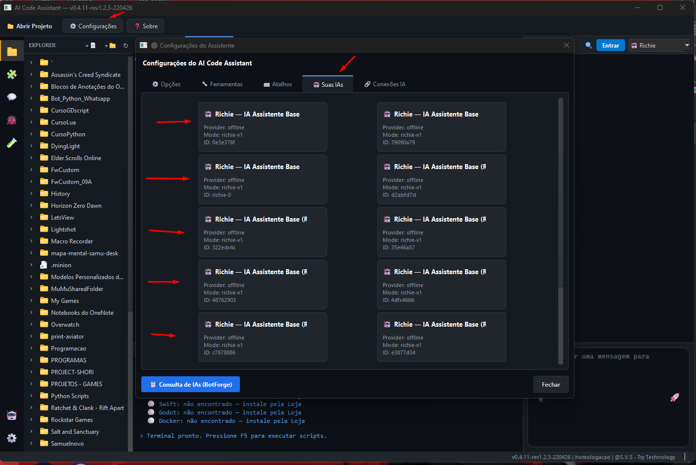
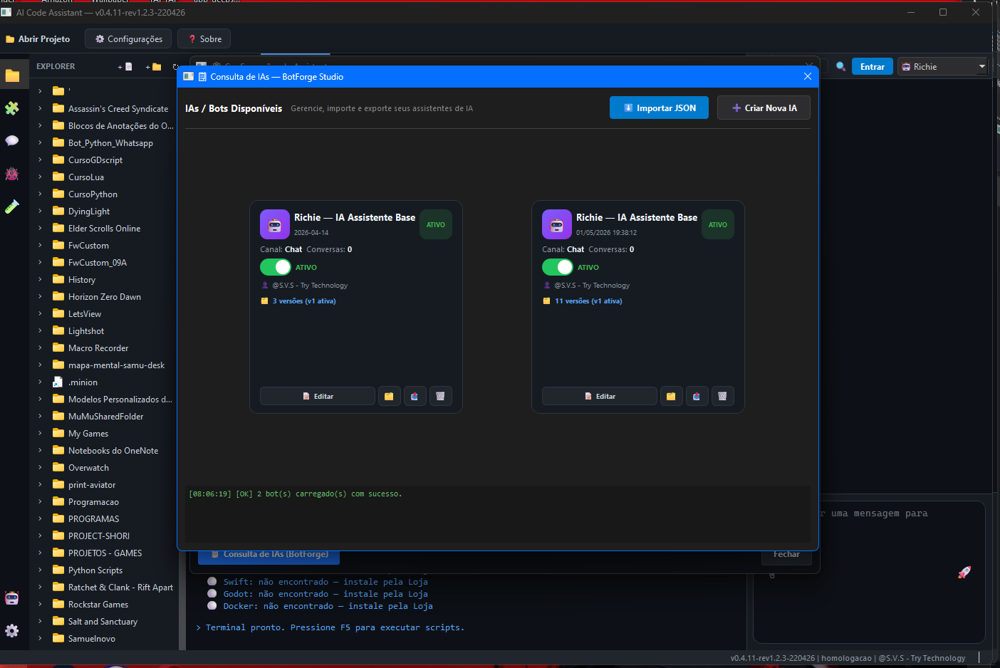
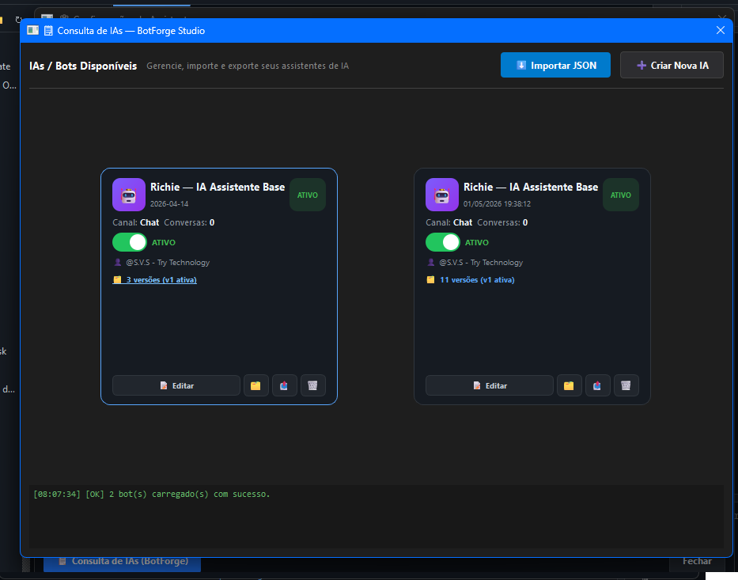
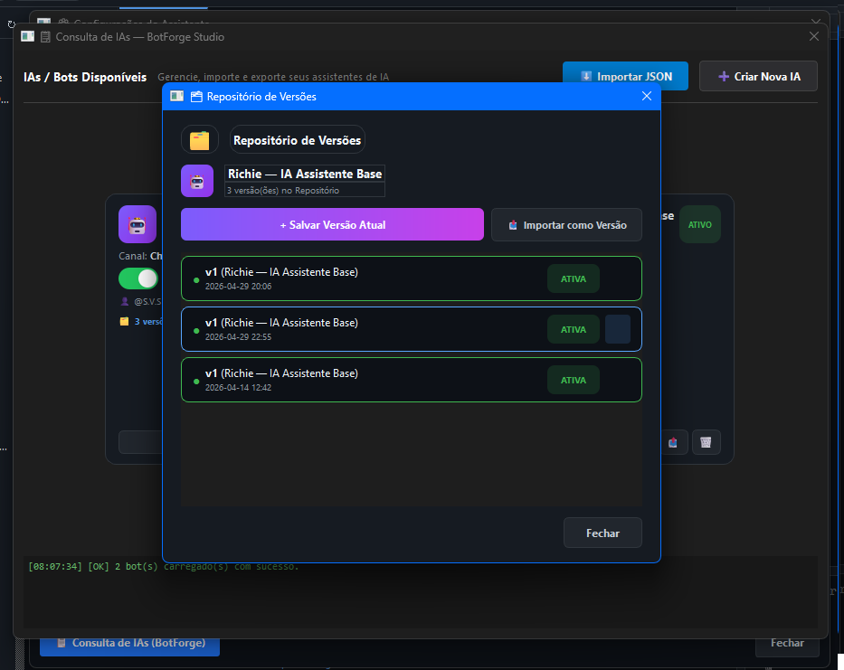
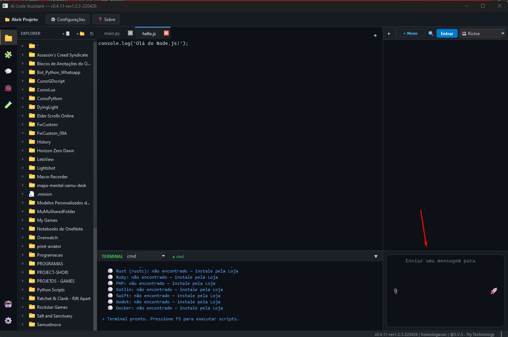
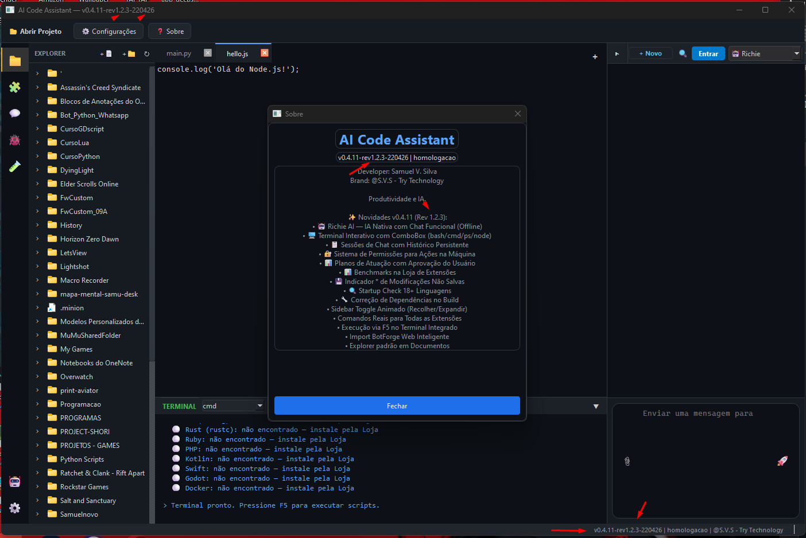

# 🤖 AI Code Assistant — Open Source


> **IDE inteligente com IA nativa embarcada** — Editor de código profissional com assistente de IA integrado (Richie AI), terminal interativo, BotForge Studio visual e suporte a múltiplos providers de IA.

---

## 📋 Sobre o Projeto

O **AI Code Assistant** é uma IDE desktop completa desenvolvida em Python + PyQt6, projetada para integrar inteligência artificial diretamente no fluxo de trabalho do desenvolvedor.

### ✨ Funcionalidades Principais

| Recurso | Descrição |
|---------|-----------|
| 🤖 **Richie AI** | IA nativa offline com chat funcional, NLP e detecção de intenções |
| 🧠 **BotForge Studio** | Editor visual de fluxos de IA (nodes & connections) estilo n8n |
| 🖥️ **Terminal Interativo** | ComboBox com bash/cmd/powershell/node/python |
| 📋 **Sessões de Chat** | Histórico persistente com múltiplas conversas |
| 🔐 **Permissões** | Sistema de aprovação para ações na máquina |
| 📊 **Planos de Atuação** | Richie propõe planos antes de executar ações |
| 🧩 **Loja de Extensões** | Instalação de linguagens com benchmarks |
| 💾 **Modificações** | Indicador * de alterações não salvas |
| 🔍 **Startup Check** | Verificação automática de 18+ linguagens |
| 🌐 **Multi-Provider** | Suporte a OpenAI, Anthropic, DeepSeek, Groq |
| 🎨 **Syntax Highlighting** | Pygments para destaque de código |
| 📁 **Explorer** | Navegador de arquivos integrado |

---

## 🖥️ Demo Windows

<p align="center">
  
</p>

### Download & Execução (Windows)

```powershell
# 1. Clonar o repositório
git clone https://github.com/SamuelVSilva/Ai_Code_Assistant_Open-Source.git
cd Ai_Code_Assistant_Open-Source

# 2. Criar ambiente virtual
python -m venv .venv
.venv\Scripts\activate

# 3. Instalar dependências
pip install -r requirements.txt

# 4. Executar
python src/main.py

# OU compilar executável:
cd Windows
build_windows2.bat
```

---

## 🐧 Demo Linux

### Download & Execução (Linux/Ubuntu)

```bash
# 1. Clonar o repositório
git clone https://github.com/SamuelVSilva/Ai_Code_Assistant_Open-Source.git
cd Ai_Code_Assistant_Open-Source

# 2. Instalar dependências do sistema
sudo apt install python3 python3-pip python3-venv

# 3. Criar ambiente e instalar libs
python3 -m venv .venv
source .venv/bin/activate
pip install -r requirements.txt

# 4. Executar
python3 src/main.py

# OU compilar executável:
cd Linux
chmod +x build_linux.sh
./build_linux.sh
```

---

## 📸 Evolução Visual

A interface evoluiu significativamente desde a primeira versão:

| Versão | Screenshot |
|--------|-----------|
| **v0.0.2 (Inicial)** |  |
| **v0.1.0** |  |
| **v0.3.5-alpha** |  |
| **v0.3.6** |  |
| **v0.4.8** |  |
| **v0.4.8-rev22** |  |
| **v0.4.11 (atual)** |  |

---

## 🐛 Bugs Identificados (v0.4.11-rev1.2.17)

A tabela abaixo documenta os bugs conhecidos nesta versão:

| # | Bug | Imagem | Status |
|---|-----|--------|--------|
| 1 | Dados persistentes — rastros de modelos na guia "Suas IAs" |  | 🔴 Aberto |
| 2 | Botão lixeira para apagar modelos não funciona corretamente | *(nome de arquivo excedeu limite Windows)* | 🔴 Aberto |
| 3 | BotForge — modelos múltiplos com mesmo nome nos cards |  | 🔴 Aberto |
| 4 | BotForge — versões inconsistentes (parte 1) |  | 🔴 Aberto |
| 5 | BotForge — edição e exclusão não funcionam |  | 🔴 Aberto |
| 6 | Redimensionamento do campo de input do chat |  | 🔴 Aberto |
| 7 | Versionamento travado na atualização |  | 🔴 Aberto |

---

## 📦 Estrutura do Projeto

```
AI_Code_Assistant/
├── src/
│   ├── main.py                          # Entry point
│   ├── core/
│   │   ├── richie_ai.py                 # Motor IA Richie (offline NLP)
│   │   ├── json_flow_engine.py          # Motor de execução BotForge
│   │   ├── ai_manager.py                # Gerenciador de providers
│   │   ├── custom_ai_manager.py         # CRUD de modelos customizados
│   │   ├── training_manager.py          # Treinamento e fine-tuning
│   │   ├── token_optimizer.py           # Otimização de contexto
│   │   └── response_cache.py            # Cache de respostas
│   ├── gui/
│   │   ├── main_window.py               # Interface principal (2787 linhas)
│   │   └── dialogs/
│   │       ├── ai_consult.py            # Consulta IA avançada
│   │       ├── create_ai_dialog.py      # BotForge Studio visual
│   │       ├── extension_store_sidebar.py
│   │       ├── extension_store_view.py
│   │       ├── settings_window.py
│   │       └── training_dialog.py
│   └── providers/                       # OpenAI, Anthropic, DeepSeek
├── config/
│   ├── providers.yaml                   # Configuração de providers
│   └── settings.yaml                    # Configurações gerais
├── templates-modelos/
│   └── Richie_(Rev_1.2.11-Gemini).json  # Modelo padrão do Richie
├── docs/                                # Changelogs, tecnologias, bugs
├── Linux/                               # Build script Linux
├── Windows/                             # Build script Windows
├── Mac/                                 # Build script macOS
├── requirements.txt
├── LICENSE                              # CC BY-NC 4.0
└── README.md
```

---

## 📊 Versão Atual

| Campo | Valor |
|-------|-------|
| **Versão** | `v0.4.11-rev1.2.17-s64` |
| **Build Date** | `06/05/2026` |
| **Ambiente** | `homologação` |
| **Richie AI** | `Rev 1.2.11-Gemini` |
| **Python** | `3.10+` |
| **GUI** | `PyQt6` |

---

## 🛠️ Requisitos

```txt
PyQt6>=6.5.0
requests>=2.31.0
openai>=1.0.0
anthropic>=0.18.0
pyyaml>=6.0
watchdog>=3.0.0
pygments>=2.17.0
tiktoken>=0.5.0
aiofiles>=23.0.0
```

---

## 👨‍💻 Desenvolvedor

**Samuel V. Silva** (@S.V.S)  
**Try Technology**

- GitHub: [@SamuelVSilva](https://github.com/SamuelVSilva)

---

## 📜 Licença

Este projeto está licenciado sob **Creative Commons Attribution-NonCommercial 4.0 International (CC BY-NC 4.0)**.

- ✅ **Permitido**: Uso pessoal, educacional e distribuição gratuita
- ✅ **Permitido**: Comercialização de bots/IAs criados na plataforma BotForge
- ❌ **Proibido**: Venda ou redistribuição comercial do software em si
- ❌ **Proibido**: Comercialização do modelo Richie AI nativo

Veja o arquivo [LICENSE](LICENSE) para detalhes completos.

---

<p align="center">
  <sub>© 2026 Samuel V. Silva (@S.V.S) — Try Technology. Todos os direitos reservados.</sub>
</p>
